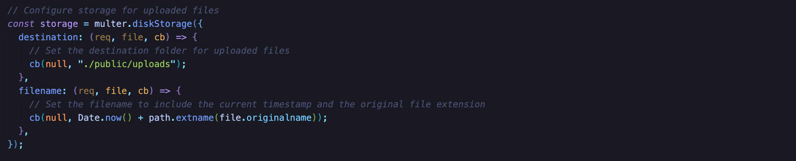
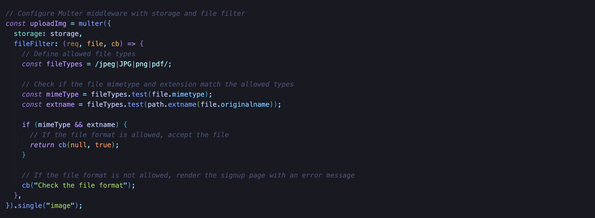
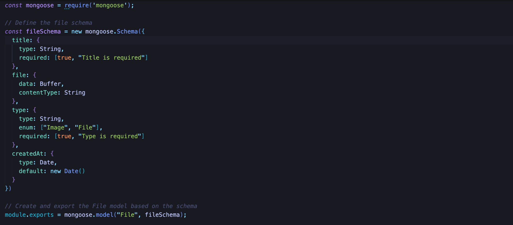
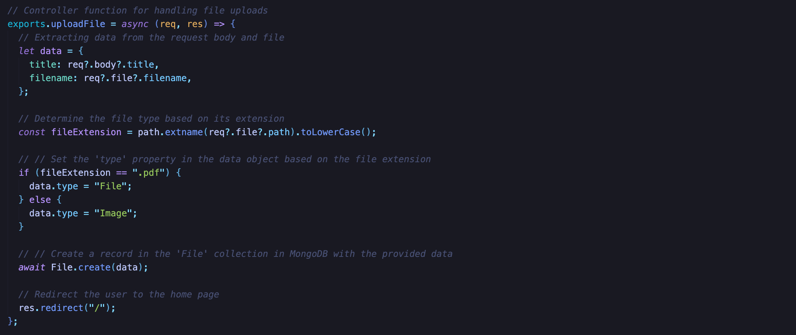
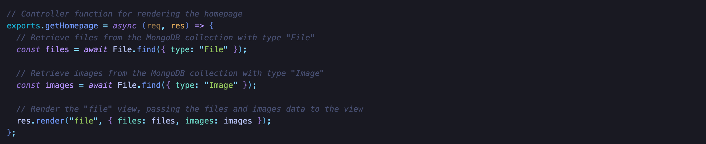
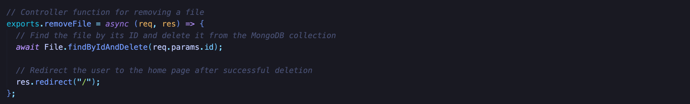

# uploadDemoCode

## 1. Project Structure

```
UploadDemoCode/
├── controllers/
|   ├── file.js
├── middlewares/
|   ├── upload.js
├── models/
|   ├── user.js
├── public/
|   ├── images/
|   ├── css/
|   ├── javascripts/
|   ├── uploads/
├── routes/
|   ├── file.js
├── views/
|   ├── partials/
|   ├── homepage.js
|   ├── signup.js
|   ├── signin.js
├── .env
├── .gitignore
├── app.js
├── package-lock.json
├── package.json
├── README.md
```

1. `controllers/`
This directory contains files responsible for handling the logic and functionality of the application.

2. `middlewares/`
Middleware functions are stored here. These functions can be applied to routes to perform tasks like authentication (auth.js), hashing (hash.js), and handling file uploads (upload.js).

3. `models/`
This directory holds the data models for interacting with the database.

4. `public/`
This directory usually contains static assets that can be served directly to the client, such as images, CSS files, and JavaScript files.

5. `routes/`
This directory probably contains JavaScript files defining the routes and corresponding handlers for the application.

6. `views/`
This directory typically contains files responsible for rendering HTML templates and views.

7. `.env`
This file contains ENVIRONMENT VARIABLES such as SECRET KEY, which is meant to be hidden and ignored by `.gitignore`.

8. `.gitignore`
Specifies files and directories to be ignored by Git, preventing them from being tracked.

9. `app.js`
This file is commonly used to store environment variables for the application.

10. `package.json` & `package-lock.json`
Manage dependencies and package versions.

11. `README.md`
A text file containing useful reference information about this project.

## 2. Packages:

1. `dotenv`
A zero-dependency module that loads environment variables from a .env file into process.env. This is useful for managing configuration in your Node.js applications.

2. `ejs`
Embedded JavaScript templating engine for rendering dynamic content on the server side.

3. `express`
A popular web framework for Node.js that simplifies the process of building web applications. 

4. `mongodb`
The official MongoDB driver for Node.js. It allows your Node.js application to interact with a MongoDB database.

5. `mongoose`
A higher-level abstraction over the MongoDB driver, providing a more convenient and structured way to work with MongoDB databases in a Node.js environment.

6. `multer`
A middleware for handling file uploads in Express.js. It's often used with forms that include file input fields.

7. `nodemon`
A utility that monitors for changes in your Node.js application and automatically restarts the server when changes are detected. 

## 3. Build

To clone and run this project, you'll need [Git](https://git-scm.com) and [Node.js](https://nodejs.org/en/download/) (which comes with [npm](https://npmjs.com)) installed on your computer.

- Prequisite: VSCode or Other IDE / Editor

- From your CLI, Terminal or SHELL:

```bash
# Clone this repository
$ git clone https://github.com/HaAnh18/uploadDemoCode.git

# Install dependencies
$ npm install

# Start with npm
$ npm start

# OR Start with node
$ node app.js
```

## 4. Custom Database

To change the database location, you'll need to go to `.env` file and change the value of variable DATABASE to your own MongoDB link 


## 5. Descriptions

### Handle Uploaded File



- Multer is configured with a disk storage engine `multer.diskStorage` to define the destination and filename for storing uploaded files

- The `destination` function will determine where file will be stored and in this function, all of the uploaded files will be saved in `/public/uploads`

- The `filename` function will generate a unique filename based in the current timestamp and the original file extension



- The `fileFilter` function will be used to validate the uploaded file is acceptable based on its mimetype and extension

- The variable `fileTypes` defines a regular expression that matches allowed file formats: JPEG, JPG, PNG, and PDF.

- If both the mimetype and extension are allowed, `cb(null, true)` is called to accept the file.

- If the file format is not allowed, `cb("Check the file format")` is called to reject the file with an error message.

### File Model



- The `fileSchema` is created using `mongoose.Schema`. It defines the structure of the documents that will be stored in the MongoDB collection associated with the `File` model.

### Controller Functions

#### Upload File 



- The `uploadFile` function handles the file upload 

- It extracts data from the request body and file, including content type.

- It would check the file type based on its extension. If the extension is `pdf` the type is set to `File`; otherwise it's set to `Image`.

- The data is then used to create a new document in the `File` collection using `File.create`.

- After successful creation, the user is redirected to the homepage

#### Get Homepage 



- The `getHomepage` function would retrieve files from the `File` collection based on their type (`File` and `Image`) using `File.find`. Then it would render the `file` view, passing the files and images to be displayed

#### Remove File



- This function deletes a file from the `File` collection based on its ID using `File.findByIdAndDelete`. After deletion, the user is redirected to the homepage (`/`).

#### Get PDF


- Retrieves the PDF file from the MongoDB database based on its ID.

- Checks if the PDF file exists; if not, returns a 404 error response with the message "PDF not found".

- Converts the binary data of the PDF file to a base64-encoded string using `Buffer.from`.

- Sets the response headers for serving the PDF file with appropriate content type and inline disposition.

- Sends the base64-encoded PDF data as the response using `res.send`.

## 6. The Model-View-Controller (MVC) Architecture


### Model (M)

- The model interacts with the MongoDB database through Mongoose, providing an abstraction for CRUD (Create, Read, Update, Delete) operations on file-related data.

### View (V)

- The EJS templates serve as the views in the application.

- They contain HTML structures with embedded JavaScript code (using EJS syntax) to dynamically generate content based on the data provided by the controller.

### Controller (C)

- The controller in the application handles the logic and acts as an intermediary between the model (data) and the views (presentation). 

## 7. Screenshots

### Homepage


## 8. License

This software is licensed under the MIT License ©
